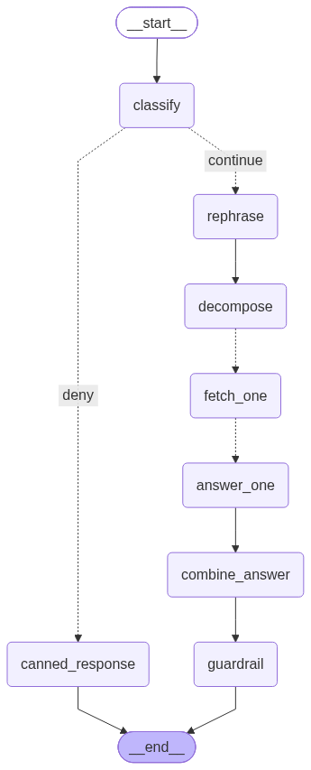

# multi-user-doc-rag

Multi-user document search & conversational Q&A over a handful of companies'
earnings-call transcripts, with per-user access control: each user is scoped
to the company (or companies) their dummy account is authorized for, enforced
at the vector-search layer itself.

## Architecture

- **Parsing/chunking** (`backend/src/ingest/`): PDFs -> markdown (Docling) ->
  speaker-turn chunks, each tagged with `company_id`.
- **Embeddings**: OpenRouter embeddings API (`nvidia/nemotron-3-embed-1b:free`
  by default).
- **Vector store**: MongoDB Atlas, using the `$vectorSearch` aggregation
  stage. Every chunk document carries its `company_id`; the Atlas Search
  index declares `company_id` as a `filter` field so a query only ever
  searches (never just post-filters) the documents the caller is authorized
  for.
- **Auth**: dummy email login (`backend/src/config/users.py` maps email ->
  authorized `company_id`s) issuing a JWT that carries that company list.
  Every retrieval request re-derives its allowed companies from the JWT, not
  from client input.
- **Conversational Q&A** (`backend/src/graph/`): a LangGraph pipeline behind
  `POST /api/conversations/{conv_id}/messages` --
  `classify -> rephrase -> fetch -> build_answer -> guardrail`. The
  classifier only routes UX (greeting / out-of-scope / real question); it is
  **not** a security control. `fetch` is the one deterministic ACL
  pre-filter, and it always uses companies re-looked-up fresh from
  `config/users.py` for the caller's email -- never the `companies` claim
  cached inside the JWT -- so a still-valid token issued before a permission
  change can't leak access. Conversation turns are stored in MongoDB, keyed
  by `user_email::conv_id` (see `backend/src/store/history_store.py`), so
  concurrent users' histories can never collide or leak into each other.

  <p align="center">
    
  </p>

  `classify` routes to either the `continue` branch (`rephrase -> decompose ->
  fetch_one -> answer_one -> combine_answer -> guardrail`) or straight to
  `canned_response` for a greeting/out-of-scope message (`greet`/`deny`).
  `decompose` splits a question naming several companies into one
  sub-question per company; `fetch_one` and `answer_one` then fan out one run
  per sub-question via LangGraph's `Send` API (dotted edges above) so they
  execute concurrently, and `combine_answer` stitches the per-company answers
  back into a single reply once every branch has finished. See
  `backend/src/graph/graph.py` for the full routing logic.
- **Prompts** (`backend/src/prompts/`): each pipeline prompt is versioned as
  `prompts/<name>/vN.txt`, with the active version per prompt pinned in
  `prompts/registry.py::CURRENT_VERSIONS`. Roll a prompt forward by adding a
  new `vN.txt` and bumping the pointer; old versions stay on disk for
  rollback/audit.
- **Frontend** (`frontend/`): a small React + TypeScript (Vite) app -- an
  email-picker login screen (`screens/Login/`, backed by a dummy
  `DEMO_USERS` list mirroring `config/users.py`) and a chat screen
  (`screens/Main/`) with a conversation sidebar, message list, and
  follow-up input, talking to the API above.

## Import paths

The codebase mixes two import styles, so a single invocation needs to satisfy
both: `api/main.py` and everything under `api/routes/` use **relative**
imports (`from ..config...`), which only resolve when imported as part of the
`backend.src.*` package (i.e. run from the **repo root**); `retrieval/`,
`ingest/`, `store/`, `graph/`, and `llm/` use **absolute** imports (`from
src.config...`), which only resolve if `backend/` itself is on `sys.path`.
Run everything from the repo root with `PYTHONPATH=backend` set (as in the
commands below) to satisfy both at once -- plain `uvicorn
backend.src.api.main:app` with no `PYTHONPATH` fails with
`ModuleNotFoundError: No module named 'src'`. The Docker image bakes in
`PYTHONPATH=/app/backend` for the same reason.

## Setup

### 1. MongoDB Atlas

Vector search (`$vectorSearch`) requires a real Atlas cluster (the free M0
tier works) or the `mongodb/mongodb-atlas-local` Docker image -- plain
community MongoDB has no vector search support.

1. Create a cluster in [Atlas](https://cloud.mongodb.com).
2. Atlas UI -> **Connect** -> **Drivers** -> copy the `mongodb+srv://...`
   connection string, filling in your database user's password.
3. Atlas UI -> **Network Access** -> add your current IP (or `0.0.0.0/0` for
   local dev only).

### 2. Environment

```bash
cp .env.example .env
```

Fill in `.env`:

| Variable | Purpose |
|---|---|
| `OPENROUTER_API_KEY` | embeddings + chat completions (conversational Q&A) |
| `SECRET_KEY` | JWT signing secret |
| `MONGO_DB_STRING` (or `MONGODB_URI`) | Atlas connection string, password filled in |
| `MONGODB_DB_NAME` / `MONGODB_COLLECTION` / `MONGODB_VECTOR_INDEX` | optional, sensible defaults |
| `CHAT_MODEL_NAME` | optional, chat-completion model for conversational Q&A (any OpenRouter chat-capable slug; reuses `OPENROUTER_API_KEY`) |
| `MONGODB_HISTORY_COLLECTION` | optional, collection for per-user conversation history |

### 3. Install & ingest

Run from the **repo root** (not `backend/` -- the ingest scripts default to
`data/...` paths relative to the repo root):

```bash
python -m venv .venv && source .venv/bin/activate
pip install -r requirements.txt

PYTHONPATH=backend python -m src.ingest.parser        # data/*.pdf -> data/parsed/*.json
PYTHONPATH=backend python -m src.ingest.chunker       # data/parsed/*.json -> data/chunks/*.json
PYTHONPATH=backend python -m src.ingest.embed_and_store   # embeds chunks, upserts into MongoDB Atlas,
                                                            # creates the vector index on first run
```

The vector index takes ~30-60s to become queryable after first creation;
`embed_and_store.py` waits for that automatically.

### 4. Run the API

```bash
PYTHONPATH=backend uvicorn backend.src.api.main:app --reload
```

```bash
# Login as a dummy user (see backend/src/config/users.py for the email -> company map)
curl -s -X POST localhost:8000/api/auth/login -H 'content-type: application/json' \
  -d '{"email": "alice@example.com"}' | tee /tmp/login.json

TOKEN=$(python3 -c "import json;print(json.load(open('/tmp/login.json'))['access_token'])")

# Query -- results are restricted to alice's authorized companies (TCS, Infosys)
curl -s -X POST localhost:8000/api/query -H "authorization: Bearer $TOKEN" \
  -H 'content-type: application/json' -d '{"query": "What was revenue growth?"}'

# Create a conversation -- returns a conv_id up front (e.g. for a "New Chat" button)
curl -s -X POST localhost:8000/api/conversations -H "authorization: Bearer $TOKEN" | tee /tmp/conv.json

CONV_ID=$(python3 -c "import json;print(json.load(open('/tmp/conv.json'))['conv_id'])")

# Conversational Q&A -- synthesized answer + citations, with follow-up support
curl -s -X POST localhost:8000/api/conversations/$CONV_ID/messages -H "authorization: Bearer $TOKEN" \
  -H 'content-type: application/json' -d '{"message": "What was revenue growth?"}'

# Follow-up in the same conversation -- same conv_id, so history is applied
curl -s -X POST localhost:8000/api/conversations/$CONV_ID/messages -H "authorization: Bearer $TOKEN" \
  -H 'content-type: application/json' -d '{"message": "and what about margins?"}'

# List this user's conversations
curl -s localhost:8000/api/conversations -H "authorization: Bearer $TOKEN"

# Fetch the full thread for one conversation
curl -s localhost:8000/api/conversations/$CONV_ID -H "authorization: Bearer $TOKEN"
```

### 5. Run the frontend

```bash
cd frontend
cp .env.example .env   # VITE_API_IP / VITE_API_PORT -- must be reachable from the browser
npm install
npm run dev
```

Open the printed Vite URL (default `http://localhost:5173`), pick one of the
demo emails on the login screen, and chat. `frontend/src/screens/Login/demoUsers.ts`
mirrors `backend/src/config/users.py`'s email -> company mapping for display
purposes only -- access control is still enforced entirely server-side.

### Tests

```bash
pytest
```

Run from the repo root (`tests/conftest.py` puts `backend/` on `sys.path`
itself, so no `PYTHONPATH` is needed here).

## Run with Docker

`docker-compose.yml` runs the backend and frontend and connects to your
MongoDB Atlas cluster using `MONGO_DB_STRING` from `.env` -- there's no local
mongodb container:

```bash
cp .env.example .env   # fill in OPENROUTER_API_KEY, MONGO_DB_STRING (Atlas), etc
docker compose up --build
```

The containers don't run ingestion automatically; do that once, either on the
host (Setup step 3) or inside the container:

```bash
docker compose exec backend python -m src.ingest.parser
docker compose exec backend python -m src.ingest.chunker
docker compose exec backend python -m src.ingest.embed_and_store
```

Then the API is at `localhost:8000` and the frontend at `localhost:5173`. If
the backend is reachable at a different host/IP than `localhost`, rebuild the
frontend with `docker compose build --build-arg VITE_API_IP=...` (see the
comment in `docker-compose.yml`).

## Access control model

`DUMMY_USERS` in `backend/src/config/users.py` maps each dummy email to the
`company_id`s it may access, e.g.:

```python
DUMMY_USERS: dict[str, list[str]] = {
    "alice@example.com": ["TCS", "Infosys"],
    "bob@example.com": ["Axis"],
    "carol@example.com": ["Hdfc"],
    "dave@example.com": ["TataTechnologies"],
    "eve@example.com": ["TCS", "Hdfc"],
}
```

Login issues a JWT embedding that company list. `POST /api/query` decodes the
JWT (`get_current_user`) and passes `companies` straight into
`$vectorSearch`'s `filter`, so unauthorized companies' chunks are excluded
from the similarity search itself -- never fetched, never ranked, never
returned.

`POST /api/conversations/{conv_id}/messages` goes one step further: it only trusts the JWT for identity
(the `email` claim) and re-looks-up that user's authorized companies fresh
from `config/users.py` on every request, rather than trusting the
`companies` claim baked into the token at login time. That way, revoking or
changing a user's access takes effect immediately, even against a JWT that
hasn't expired yet.
