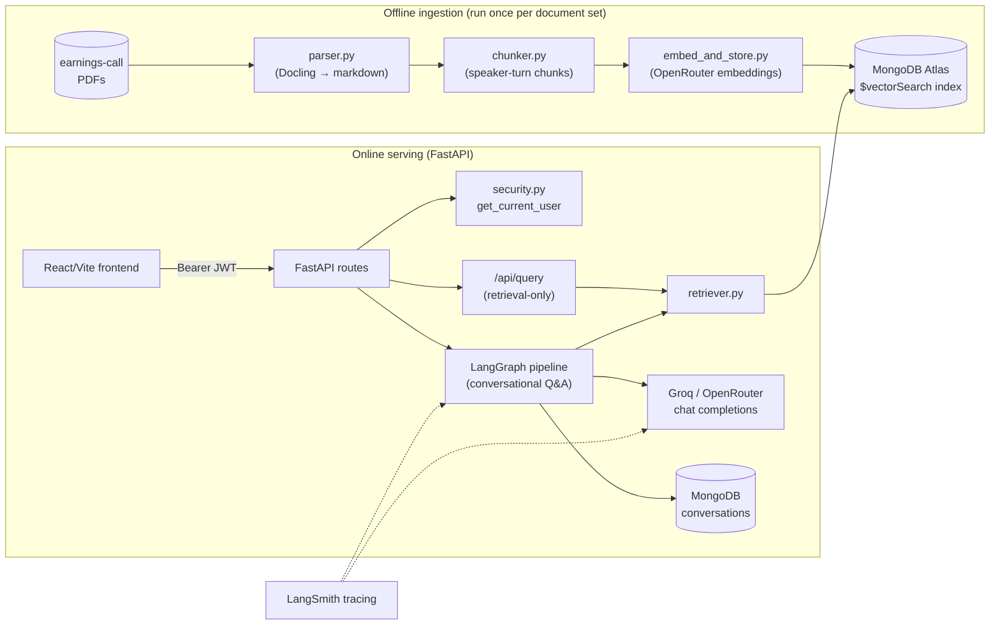
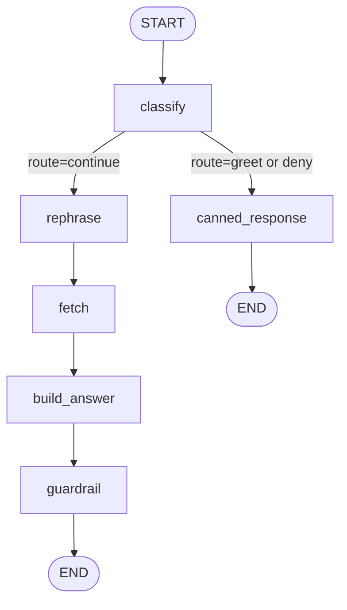
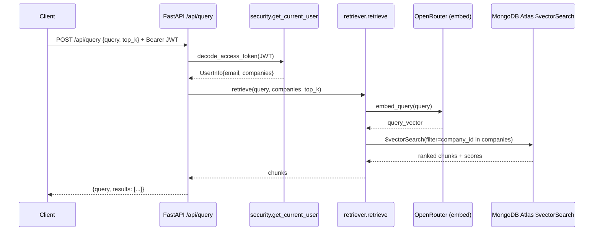
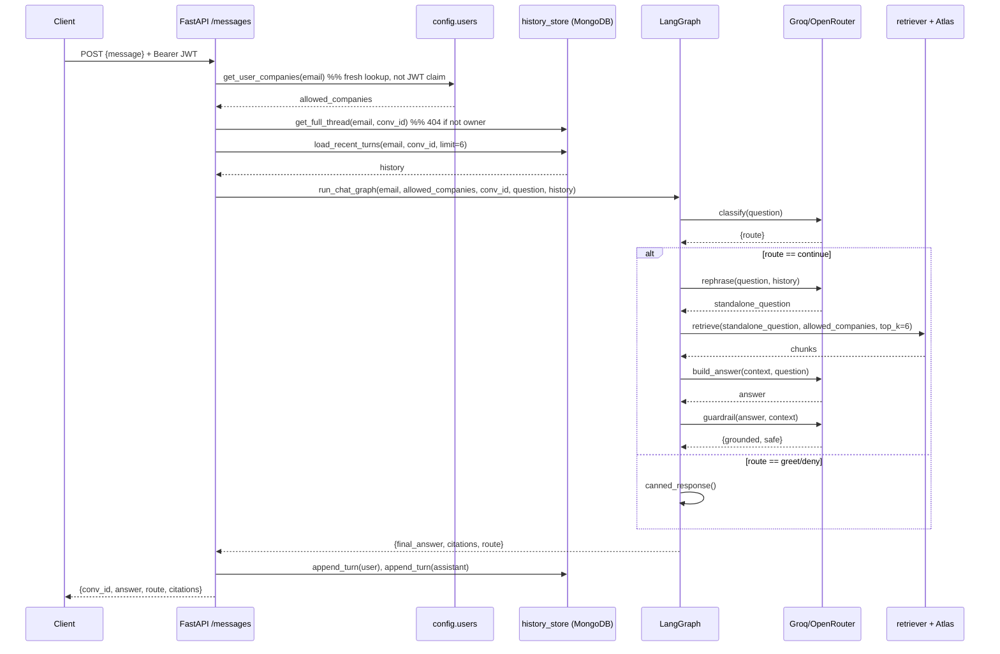
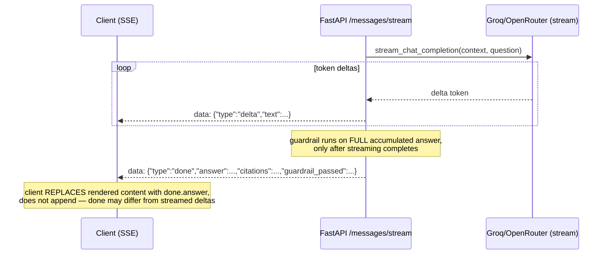

# multi-user-doc-rag — Implementation Reference

Technical deep-dive into how this system is actually built: every pipeline stage,
every LangGraph node, the access-control model, and the UI. This is a reference
document, not a pitch — it documents what the code does today, including
trade-offs and known limitations, so it stays useful while extending the system.

For a lighter narrative walkthrough, see `docs/system-dossier.html`. This document
goes deeper and is organized for engineering reference.

## Table of contents

1. [System overview](#1-system-overview)
2. [Dataset](#2-dataset)
3. [Ingestion pipeline](#3-ingestion-pipeline)
   - [3.1 Parsing (Docling)](#31-parsing-docling)
   - [3.2 Chunking strategy (speaker-turn segmentation)](#32-chunking-strategy-speaker-turn-segmentation)
   - [3.3 Length-bounded splitting ("token parsing")](#33-length-bounded-splitting-token-parsing)
4. [Embedding layer](#4-embedding-layer)
5. [Vector store & indexing (MongoDB Atlas)](#5-vector-store--indexing-mongodb-atlas)
6. [Retrieval / RAG inference timeline](#6-retrieval--rag-inference-timeline)
7. [Authentication & role-based access control](#7-authentication--role-based-access-control)
8. [Conversational orchestrator (LangGraph)](#8-conversational-orchestrator-langgraph)
9. [LLM client layer](#9-llm-client-layer)
10. [Prompt management & versioning](#10-prompt-management--versioning)
11. [Conversation history & multi-user isolation](#11-conversation-history--multi-user-isolation)
12. [API reference](#12-api-reference)
13. [Observability](#13-observability)
14. [Frontend / UI](#14-frontend--ui)
15. [Deployment](#15-deployment)
16. [Testing](#16-testing)
17. [Known limitations & recommended improvements](#17-known-limitations--recommended-improvements)
18. [Appendix: end-to-end request timelines](#18-appendix-end-to-end-request-timelines)

---

## 1. System overview



| Layer | Technology | Location |
|---|---|---|
| PDF → text | Docling | `backend/src/ingest/parser.py` |
| Chunking | Regex-based speaker-turn segmentation | `backend/src/ingest/chunker.py` |
| Embeddings | OpenRouter Embeddings API (`nvidia/nemotron-3-embed-1b:free`) | `backend/src/ingest/embed_and_store.py` |
| Vector store | MongoDB Atlas `$vectorSearch` | `backend/src/store/mongo_store.py` |
| Retrieval | Query embedding + company-scoped ANN search | `backend/src/retrieval/retriever.py` |
| Orchestration | LangGraph state machine | `backend/src/graph/` |
| Chat completions | Groq (default) or OpenRouter, OpenAI-compatible SDK | `backend/src/llm/client.py` |
| Auth | Dummy email login, JWT (HS256) | `backend/src/api/security.py`, `config/users.py` |
| History | MongoDB, keyed `email::conv_id` | `backend/src/store/history_store.py` |
| API | FastAPI | `backend/src/api/` |
| Observability | LangSmith tracing + rotating file logs | `backend/src/config/observability.py`, `logger.py` |
| Frontend | React 19 + TypeScript + Vite | `frontend/src/` |

Two independent request paths exist against the same vector store:

- **`POST /api/query`** — retrieval-only. Returns raw ranked chunks, no LLM
  synthesis. Used for debugging/inspection and as the minimal "search" primitive.
- **`POST /api/conversations/{conv_id}/messages(/stream)`** — full conversational
  RAG: intent routing → history-aware rephrasing → ACL-scoped retrieval →
  LLM answer synthesis with citations → groundedness guardrail.

---

## 2. Dataset

4–5 Indian companies' earnings-call transcript PDFs (`data/*.pdf`): TCS,
Infosys, Tata Technologies, Axis Bank, HDFC Bank. Each is a multi-page PDF
transcript of prepared remarks followed by a Q&A session with analysts.
`data/parsed/` holds the Docling markdown output per document; `data/chunks/`
holds the chunked JSON actually loaded into the vector store.

---

## 3. Ingestion pipeline

### 3.1 Parsing (Docling)

`parser.py::parse_pdf` runs each PDF through `docling.DocumentConverter` and
calls `doc.export_to_markdown()`, producing a single markdown string per
document (tables become markdown tables, headings become `#`/`##`, no OCR
fallback logic beyond what Docling does internally).

**Metadata extraction** (`extract_metadata`) is regex-based, not LLM-based:

- **Period** (`PERIOD_PATTERN`): matches `Q1FY24`, `H2 FY2025`, `FY2024-25`,
  `"quarter ended March 31, 2026"`, `"Apr-2026"` style tokens — tried first
  against the filename stem, then against the first 5000 chars of body text.
- **Company** (`_company_from_filename` / `COMPANY_SUFFIX_PATTERN`): the
  filename stem is title-cased first (`tcs` → `Tcs`... but see caveat below);
  if that's empty, falls back to scanning the first 3000 chars of text for a
  line ending in `Limited`/`Ltd`/`Inc`/`Corporation`/`Bank`.

Output: `ParsedDocument{metadata: DocumentMetadata, text: str}`, written to
`data/parsed/<stem>.json` as `{"metadata": {...}, "text": "..."}`.

**Pros**

- Docling handles PDF table/layout extraction far better than naive
  `pdftotext`, which matters for transcripts with tabular financial summaries.
- Zero LLM cost/latency in the parsing step — pure local inference (CPU
  torch models for layout/OCR).
- Markdown output is a good intermediate format: heading structure survives
  into the chunker's section/speaker detection.

**Cons / drawbacks**

- Docling's layout+OCR models pull in `torch`/`torchvision` (CPU build,
  still sizeable) — this is why `parser.py` is isolated into a separate
  Docker image (`Dockerfile.ingest`) rather than shipped in the serving image.
- Metadata extraction is filename/regex-driven, not content-verified: a
  misnamed PDF (e.g. `Q1_2026.pdf` with no company name in the filename)
  produces a wrong or missing `company` unless the text-fallback regex
  happens to match a `"... Limited"` line early in the document.
- No page-level provenance is kept post-parsing — `text` is one flat string,
  so a chunk can't be traced back to a PDF page number, only to a
  character offset within the flattened markdown.
- Conversion is synchronous and per-file; large batches of PDFs parse
  serially in `parse_directory`, with no parallelism.

### 3.2 Chunking strategy (speaker-turn segmentation)

`chunker.py::chunk_document` is the core ingestion logic. Rather than
generic fixed-size/sliding-window chunking, it segments each transcript by
**who is speaking**, on the theory that a speaker turn is the natural
semantic unit in an earnings call (an analyst's question, or a CFO's answer,
should not be arbitrarily split mid-thought by a fixed token window).

**Algorithm, step by step:**

1. **Section split** — `split_sections` looks for a Q&A marker
   (`QA_MARKER_PATTERN`: phrases like *"question and answer session"*,
   *"happy to take questions"*, *"opening the floor for questions"*) and
   splits the document into exactly two sections: `prepared_remarks` and
   `qa`. If no marker is found, the whole document is one `prepared_remarks`
   section.
2. **Speaker discovery** — `find_valid_speakers` scans the *entire* document
   with two regexes:
   - `SPEAKER_PATTERN` — inline "Name:" turn openers (`"K Krithivasan: ..."`,
     `"| Nehal Shah: ..."`).
   - `HEADER_SPEAKER_PATTERN` — markdown-heading-style speaker turns with no
     colon (`"## Yogesh Aggarwal"`), used by some transcript formats
     (Infosys-style).
   A name only counts as a genuine speaker if it recurs at least
   `MIN_SPEAKER_OCCURRENCES = 2` times — this filters out one-off false
   positives like letter salutations (`"Sub:"`, `"Encl:"`) that match the
   colon pattern but aren't actual speakers.
3. **Turn splitting** — `split_speaker_turns` walks the valid-speaker
   matches in document order and slices the text between consecutive
   matches into `(speaker, text)` turns. Any text before the first
   recognized speaker becomes a `(None, text)` preamble turn (e.g. the cover
   letter / regulatory filing boilerplate that precedes the actual call
   transcript — see the sample chunk below).
4. **Role classification** — `classify_role` labels each speaker as
   `moderator` (matches `"Moderator"`/`"Operator"`), `management` (appears
   in the prepared-remarks speaker set or the extracted management-name
   list), or `analyst` (default — anyone asking a question in the Q&A who
   isn't recognized management).
5. **Management-name extraction** — `extract_management_names` looks for a
   `"MANAGEMENT:"` / `"CORPORATE PARTICIPANTS:"` header block and pulls names
   either from markdown sub-headings (Infosys-style) or from `"Mr./Ms./Dr. X"`
   title patterns (Axis/HDFC-style), with the block's end boundary
   determined by the next `"Analysts:"` header or the next markdown heading.
   Falls back to the set of prepared-remarks speakers if no explicit block is
   found.
6. **Q&A pairing** — within the `qa` section, each time an `analyst` speaks,
   a new `qa_pair_id` (`{doc_id}_qa_{NNN}`) is minted and stays attached to
   subsequent `management` turns until the next analyst turn — grouping a
   question with its answer(s) even across multiple management responses.
7. **Long-turn splitting** — `_split_long_text` further splits any single
   turn longer than `MAX_CHUNK_CHARS` (see §3.3).
8. **ID assignment** — `company_id` is a slugified company name (alphanumeric
   only, e.g. `"TataTechnologies"`); `doc_id = {company_id}_{quarter}_{year}`
   (quarter/year derived by `derive_fiscal` via `QUARTER_PATTERN`/
   `YEAR_PATTERN` over the period metadata or the document's first 3000
   chars); `chunk_id = {doc_id}_{section_type}_{NNN}`, a zero-padded
   per-section counter.

**Resulting chunk schema** (one JSON object per chunk in `data/chunks/*.json`):

```json
{
  "company_id": "TCS",
  "doc_id": "TCS_Q4_2026",
  "section_type": "qa",
  "speaker_name": "K Krithivasan",
  "speaker_role": "management",
  "qa_pair_id": "TCS_Q4_2026_qa_008",
  "management_names": ["Nehal Shah", "K Krithivasan", "Aarthi Subramanian", "Samir Seksaria", "Sudeep Kunnumal"],
  "fiscal_quarter": "Q4",
  "fiscal_year": "2026",
  "chunk_id": "TCS_Q4_2026_qa_019",
  "text": "But Kumar, just to get the clarity, I will be specific. ..."
}
```

**Pros**

- Chunks align with a real conversational unit (one person's full turn, or a
  bounded slice of one), which keeps question/answer semantics intact —
  better for citation-worthy, quotable retrieval than sliding-window chunking
  that can cut a sentence or a numeric claim in half.
- Rich structured metadata (`speaker_role`, `qa_pair_id`, `management_names`)
  is essentially free — it falls out of the same regex pass — and is
  available for future filtering/reranking (e.g. "only management answers"),
  though nothing downstream currently uses `speaker_role`/`qa_pair_id` as a
  retrieval filter yet (only `company_id` is wired into `$vectorSearch`).
- `company_id`/`doc_id` become the exact join key used by the access-control
  filter at retrieval time (§7) — the ingestion and security layers share one
  identifier scheme by construction, not by convention that could drift.

**Cons / drawbacks**

- **Entirely regex/heuristic-based, format-fragile.** There is no LLM or ML
  model verifying speaker boundaries; a transcript PDF from a company whose
  formatting doesn't match the patterns the regexes were tuned against
  (different heading style, no colon after names, names in ALL CAPS, etc.)
  will silently misparse — turns may merge into one giant chunk, or the
  moderator's script may get misattributed as `analyst`. There's no
  confidence score or fallback-to-manual-review signal.
- **`MIN_SPEAKER_OCCURRENCES = 2` is a magic number** that trades off false
  positives (salutations misread as speakers) against false negatives (a
  speaker who genuinely only talks once, e.g. an analyst who asks exactly
  one question with a name that never recurs, gets folded into the
  preceding/following unattributed turn instead of getting their own).
- **No overlap between chunks.** Unlike sliding-window chunking (which
  typically overlaps N tokens between consecutive chunks to avoid losing
  context at a boundary), speaker-turn chunks are strictly disjoint. A
  follow-up answer that depends on unstated context from two turns earlier
  can lose that context once retrieved in isolation — the LLM only sees
  whatever chunks the vector search returns, not their neighbors.
- **Section split is a single binary cut.** If a transcript has multiple
  Q&A-like sections (rare, but possible with multi-part calls) or the Q&A
  marker phrase doesn't match any of the three patterns, the entire document
  is treated as one `prepared_remarks` section and Q&A pairing never
  triggers.
- **No table-aware handling.** `_clean_turn_text` strips markdown table
  divider rows and pipe characters but doesn't reconstruct tabular data
  (e.g. a quarterly financial summary table) into a chunk-friendly form —
  numbers can end up as a flat, hard-to-parse run of tokens.
- Per the project skill notes, some fields (`speaker_role`, `qa_pair_id`,
  `management_names`) were added after the JSON currently checked into
  `data/chunks/` was generated — re-running the chunker is required to
  backfill them for older exports, which is an easy trap when debugging
  retrieval results against stale on-disk JSON.

### 3.3 Length-bounded splitting ("token parsing")

Despite the name "token" in common RAG parlance, this project's long-turn
splitter (`_split_long_text`, `MAX_CHUNK_CHARS = 1500`) is **character-count
based, not tokenizer-based**. It:

1. Returns the text unchanged if `len(text) <= 1500` characters.
2. Otherwise splits on whitespace into words and greedily packs words into
   a running buffer, flushing to a new chunk whenever adding the next word
   would push the buffer over 1500 characters — i.e. a word-boundary-safe
   greedy bin-packing, not a hard character truncation and not a tokenizer
   (`tiktoken`/model-specific BPE) based split.

**Pros**

- No dependency on a tokenizer library, and no coupling to a specific LLM's
  vocabulary — the same chunks work unchanged regardless of which chat/embed
  model is swapped in.
- Word-boundary safety means no word is ever split mid-token, avoiding
  garbled sub-word artifacts at chunk boundaries.
- Simple and fast — O(n) over the turn's words, no external calls.

**Cons / drawbacks**

- **Character count is a poor proxy for token count.** English averages
  ~4 chars/token, but earnings-call transcripts contain numbers, tickers,
  and proper nouns that tokenize less efficiently — 1500 chars is roughly
  300–400 tokens for typical prose but can vary meaningfully by content,
  so there's no hard guarantee a chunk stays under any given model's
  context-relevant token budget (this matters more for the answer-generation
  prompt, which concatenates up to `chat_top_k=6` chunks, than for the
  embedding call itself, which has generous limits).
- No overlap is applied when a turn is split (same limitation as the
  speaker-turn boundaries in §3.2) — a long management answer split into two
  pieces has zero shared context between the pieces; a question whose answer
  spans the split point may retrieve only half the reasoning.
- The 1500-char threshold is a single global constant, not tuned per
  embedding model's effective context window or per section type (`qa` vs
  `prepared_remarks` turns arguably have different ideal chunk sizes).

---

## 4. Embedding layer

`embed_and_store.py::Embedder` embeds text via **OpenRouter's Embeddings
API over HTTP** (`requests`), not a local `sentence-transformers` model.

- **Model**: `nvidia/nemotron-3-embed-1b:free` by default, overridable via
  `EMBEDDING_MODEL_NAME` in `.env` (`settings.embedding_model_name`).
- **Auth**: `OPENROUTER_API_KEY`; `Embedder.__init__` raises `ValueError`
  immediately if unset, rather than failing lazily on first request.
- **Batching**: `embed_documents(texts, batch_size=32)` chunks the input
  list and issues one HTTP POST per batch to `{base_url}/embeddings`,
  reassembling results in order (the API returns items with an `index`
  field; the code explicitly re-sorts by it before extracting vectors, since
  batched embedding APIs do not always preserve request order in the
  response).
- **Query-time embedding**: `embed_query(text)` is a single-text call
  through the same `_request` path — used by both `/api/query` and the
  graph's `fetch_node`.
- **Dimensionality is not hardcoded** — `ensure_vector_index` reads
  `len(embeddings[0])` from the first embedding batch actually returned and
  uses that to define the Atlas index, so switching embedding models (with a
  different output dimension) doesn't require a code change, only re-running
  ingestion against a fresh collection/index.

**Pros of the API-based approach (vs. a local model)**

- No GPU/CPU inference cost or ML dependency (`sentence-transformers`,
  `torch`) in the serving path — `retriever.py`'s only import cost for
  embeddings is `requests`.
- Model swaps are a config change (`EMBEDDING_MODEL_NAME`), not a redeploy
  with a different pinned model artifact.
- Consistent with the chat-completion layer's own "call a hosted API"
  design (§9) — one operational pattern for both LLM surfaces.

**Cons / drawbacks**

- **Network dependency and per-call latency/cost** on every ingested chunk
  and every query — embedding is no longer "free" compute; it's an external
  API call subject to that provider's rate limits, latency variance, and
  uptime. A query-time embedding call adds a network round-trip to every
  `/api/query` and every conversational turn's `fetch_node`, on top of the
  vector-search round-trip and (for chat) the LLM call.
- **No local fallback.** If OpenRouter is unreachable, both ingestion and
  live query-time retrieval fail outright — there's no cached/local
  embedding model to degrade to.
- **`nvidia/nemotron-3-embed-1b:free`** is a free-tier model slug — free
  tiers on model routers commonly carry tighter rate limits or availability
  guarantees than paid tiers, which is a risk for anything beyond
  demo/dev usage.
- Batch requests are sent sequentially (`for start in range(0, len(texts),
  batch_size)`), not concurrently — ingesting a large corpus is
  latency-bound by round-trips × number of batches.
- An earlier version of this codebase used a local `sentence-transformers`
  model (`all-MiniLM-L6-v2`); that path is fully retired but `HF_TOKEN` is
  still a recognized (unused) env var, a minor leftover to clean up.

---

## 5. Vector store & indexing (MongoDB Atlas)

`store/mongo_store.py` owns the connection, index lifecycle, and search
query. **This project fully migrated off Chroma** — `vector_db/` (the old
Chroma persistence dir) is stale, gitignored, and unused by any current code
path.

- **Client**: a single cached `pymongo.MongoClient` (`@lru_cache`), built
  from `settings.mongodb_uri` (accepts either `MONGODB_URI` or
  `MONGO_DB_STRING` as the env var name via a Pydantic `AliasChoices`).
- **Collection**: `{mongodb_db_name}.{mongodb_collection}` — defaults
  `multi_user_rag.transcript_chunks`.
- **Document shape**: every chunk field from the chunker (`company_id`,
  `doc_id`, `section_type`, `speaker_name`, `speaker_role`, `qa_pair_id`,
  `management_names`, `fiscal_quarter`, `fiscal_year`, `text`) is stored
  as-is, plus an `embedding` field (the float vector). `chunk_id` becomes
  the document's `_id` directly (not a separate field) — `upsert_chunks`
  uses `ReplaceOne({"_id": chunk["chunk_id"]}, doc, upsert=True)` per chunk,
  so re-running ingestion on the same source data is idempotent (matching
  `chunk_id`s overwrite in place rather than duplicating).
- **Vector index** (`ensure_vector_index`): creates an Atlas
  `$vectorSearch`-type search index (`SearchIndexModel`) with two field
  definitions:
  - `{"type": "vector", "path": "embedding", "numDimensions": <dynamic>,
    "similarity": "cosine"}`
  - `{"type": "filter", "path": "company_id"}` — **this is the field that
    makes access control possible at the ANN layer** (see §7).

  Index creation is idempotent (checks `list_search_indexes()` for an
  existing name first) and polls `queryable` status up to a 120s timeout
  before returning, since Atlas index builds are asynchronous and typically
  take 30–60s.

**Search query** (`vector_search`):

```python
pipeline = [
    {"$vectorSearch": {
        "index": "chunk_vector_index",
        "path": "embedding",
        "queryVector": query_vector,
        "numCandidates": 100,        # settings.vector_search_num_candidates
        "limit": top_k,               # 5 (query) or 6 (chat) by default
        "filter": {"company_id": {"$in": allowed_companies}},
    }},
    {"$project": {"embedding": 0, "score": {"$meta": "vectorSearchScore"}}},
]
```

`numCandidates` (100 by default) controls how many approximate nearest
neighbors Atlas considers before applying `limit`; a higher
candidates:limit ratio generally improves recall at some latency cost. The
`$project` stage drops the (large) embedding vector from the response and
surfaces the ANN similarity score under `score`.

**Deny-by-default**: both `vector_search` and the higher-level `retrieve()`
short-circuit to `[]` when `allowed_companies` is empty, *without* issuing a
search at all — this specifically guards against `{"$in": []}` being
misinterpreted as "no filter" by some Mongo query paths; the code never lets
an empty list reach `$vectorSearch`.

**Pros**

- **Filtering happens inside the ANN search itself**, not as a post-filter
  over an unfiltered top-K. This is the single most important property of
  the retrieval layer for the access-control model (§7) — an unauthorized
  chunk is never fetched, never ranked, never even considered a candidate,
  as opposed to a design that runs `$vectorSearch` unfiltered and then
  discards disallowed hits after the fact (which both wastes ranking budget
  on documents the caller can never see, and risks bugs that forget the
  post-filter step).
- Atlas `$vectorSearch` combines ANN search and metadata filtering in one
  aggregation stage/round-trip — no separate filter query needed.
- One database serves both the vector index and the conversation-history
  collection (§11) — no second datastore to operate.

**Cons / drawbacks**

- **Requires Atlas** (or the `mongodb/mongodb-atlas-local` Docker image for
  local dev) — plain community MongoDB has no `$vectorSearch` support, so
  this isn't a "just run MongoDB" dependency; it's specifically an Atlas (or
  Atlas-compatible-image) dependency, with the free M0 tier being the
  practical floor.
- **Single filter field.** The Atlas index only declares `company_id` as a
  `filter` field — access control can only ever be scoped by company. Any
  future finer-grained ACL (e.g. per-document, per-section, per-role) would
  require adding more `filter` fields to the index and plumbing the
  corresponding claims through the JWT and node logic; it's not supported
  today.
- Index creation happens lazily on first `embed_and_store.py` run and
  synchronously blocks for up to 120s waiting for `queryable` — a cold-start
  cost that only matters once per fresh collection, but is easy to trip over
  in CI/first-deploy if the timeout is too tight for the target Atlas tier.
- `numCandidates=100` and `top_k`/`chat_top_k` are static settings, not
  adaptive to query complexity or corpus size — as the corpus grows well
  past 5 companies' worth of chunks, recall may need retuning.
- No hybrid (keyword + vector) search — a query for an exact ticker symbol
  or a verbatim quoted phrase relies entirely on embedding similarity
  finding the right chunk, with no lexical/BM25 fallback.
- No reranking step after retrieval — the top-`limit` ANN results go
  straight to the LLM prompt as-is.

---

## 6. Retrieval / RAG inference timeline

`retrieval/retriever.py::retrieve` is the shared entry point used by both
`/api/query` and the graph's `fetch_node`:

```
retrieve(query, allowed_companies, top_k)
  1. if not allowed_companies: return []            # deny-by-default, no I/O
  2. query_vector = embedder.embed_query(query)      # 1 HTTP call → OpenRouter
  3. collection = mongo_store.get_collection()        # cached client, no I/O
  4. results = mongo_store.vector_search(...)          # 1 Atlas aggregate() call
  5. return results                                    # [{chunk_id, text, score, ...}, ...]
```

**Timeline of a single `/api/query` request** (retrieval-only path):

| Step | Where | Notes |
|---|---|---|
| 1. JWT decode | `security.get_current_user` | In-process, microseconds |
| 2. Embed query | `Embedder.embed_query` → OpenRouter HTTP | Network round-trip; dominant latency source for short queries |
| 3. `$vectorSearch` aggregate | Atlas | ANN over `numCandidates=100`, filtered by `company_id`, limited to `top_k` |
| 4. Response serialization | FastAPI/Pydantic | In-process |

**Timeline of a conversational turn** (`POST /api/conversations/{id}/messages`,
non-streaming) — see §8 for full node detail:

| Step | Node | LLM call? | Notes |
|---|---|---|---|
| 1 | Auth + fresh company lookup | No | `get_user_companies(email)`, not the JWT's cached claim |
| 2 | History load | No | `history_store.load_recent_turns` (Mongo find) |
| 3 | `classify` | Yes (fast, `temperature=0.0`) | JSON route decision |
| 4 | `rephrase` | Yes, only if history non-empty | Standalone-question rewrite |
| 5 | `fetch` | No (embeds + searches) | Same path as `/api/query`, `top_k=chat_top_k=6` |
| 6 | `build_answer` | Yes | Full context-grounded generation |
| 7 | `guardrail` | Yes, unless disabled or no chunks | Groundedness/safety check |
| 8 | Persist turns | No | Two Mongo writes (`user` + `assistant` turns) |

Non-streaming conversational turns therefore make **up to 4 sequential LLM
calls** (classify, rephrase, build_answer, guardrail) plus one embedding
call, all synchronous/sequential — there is no parallelization across
nodes, since each node's output feeds the next (classify's route decides
whether rephrase/fetch/build_answer run at all; guardrail needs the
completed answer). The **streaming** variant (`/messages/stream`, §8)
removes user-perceived latency for the `build_answer` step specifically by
streaming its tokens as they're generated, but still runs classify →
rephrase → fetch synchronously before the stream starts, and still runs the
guardrail synchronously *after* the stream completes (it needs the full
answer text to judge groundedness) — so total wall-clock time is similar;
only perceived latency to first content improves.

---

## 7. Authentication & role-based access control

### 7.1 Identity: dummy email login

`config/users.py::DUMMY_USERS` is a static, in-code map — no password, no
real user database, matching the assignment's "dummy login" requirement:

```python
DUMMY_USERS: dict[str, list[str]] = {
    "alice@example.com": ["TCS", "Infosys"],
    "bob@example.com":   ["Axis"],
    "carol@example.com": ["Hdfc"],
    "dave@example.com":  ["TataTechnologies"],
    "eve@example.com":   ["TCS", "Hdfc"],
}
```

`POST /api/auth/login` (`api/routes/auth.py`) looks up the submitted email;
unknown emails get `401 Unknown user email`. On success, it issues a JWT
(`security.create_access_token`) whose payload is:

```json
{"sub": "alice@example.com", "companies": ["TCS", "Infosys"], "exp": <unix ts>}
```

HS256-signed with `settings.secret_key` (env `SECRET_KEY`), 60-minute
expiry (`access_token_expire_minutes`).

### 7.2 The two enforcement paths — and why they differ

Every authenticated route depends on `security.get_current_user`, which
decodes the bearer token into a `UserInfo{email, companies}` and raises
`401` on a missing, invalid, or expired token. **What happens next diverges
by endpoint, deliberately:**

- **`/api/query`** trusts the JWT's `companies` claim directly:
  `retrieve(payload.query, current_user.companies, ...)`. Simple, and
  correct as long as the token is fresh — the JWT was minted from
  `DUMMY_USERS` at login time.

- **`/api/conversations/{conv_id}/messages(/stream)`** does **not** trust
  the JWT's `companies` claim. It re-derives the caller's authorized
  companies on every request via a fresh `get_user_companies(current_user.email)`
  lookup against `config/users.py`, using the JWT only for the `email`
  identity claim:

  ```python
  allowed_companies = get_user_companies(current_user.email)
  if allowed_companies is None:
      raise HTTPException(401, "Unknown user")
  ```

  **Why this matters**: a JWT is valid (signature intact, not expired) for
  up to 60 minutes after login. If a user's access is revoked or changed in
  `DUMMY_USERS` mid-session (in a real system, mid-token-lifetime), a route
  that trusted the token's baked-in `companies` claim would keep honoring
  stale permissions until the token expires. Re-deriving from the source of
  truth on every chat request closes that window — access changes take
  effect on the *next* request, not the next login. This is the more
  conservative of the two designs, and is the one the assignment's
  isolation requirements are graded against (see
  `tests/test_data/access_control_test_cases.json` test case 9,
  "jwt_tampering").

### 7.3 Where the filter actually applies

`allowed_companies` — from whichever of the two paths above — flows
unchanged into `retrieve()` → `mongo_store.vector_search()`'s
`filter={"company_id": {"$in": allowed_companies}}` inside the
`$vectorSearch` aggregation stage itself (§5/§6). This is the crux of the
"role-based response" mechanism: **there is no role or permission concept
beyond "list of company_ids"**, and enforcement happens once, at the one
place both request paths converge (`mongo_store.vector_search`) — not
re-implemented per-endpoint, not applied as a post-filter, and not
delegated to the LLM or the UI.

The LangGraph `classify` node's routing decision (`greet`/`deny`/`continue`)
is explicitly **not** a security control — its prompt (`prompts/classifier/v1.txt`)
says so directly, and `graph/nodes.py`'s module docstring repeats it. It only
shapes UX (e.g. routing a "hi" to a canned greeting instead of a wasted
retrieval+generation round-trip); a `continue`-routed question about a
company the user isn't authorized for still goes through `fetch_node`, which
returns zero chunks for that company, which `build_answer_node` turns into
`NO_CONTEXT_MESSAGE` — access control is enforced deterministically by the
vector-search filter, not by the classifier declining to answer.

### 7.4 Pros

- Enforcement lives in exactly one function (`mongo_store.vector_search`),
  reducing the surface area for a missed-filter bug — every retrieval path
  (raw query endpoint, graph `fetch_node`) calls through the same
  `retrieve()` → `vector_search()` chain.
- The chat path's fresh-lookup design (§7.2) defends against a real class of
  bug: stale-but-valid tokens outliving a permission change. This is
  stronger than most JWT-claims-as-authorization designs.
- `company_id` is shared verbatim between the ingestion pipeline (§3.2) and
  the access-control map — no separate mapping table that could drift out
  of sync with what's actually in the vector store.
- Deny-by-default on an empty `allowed_companies` list (§5/§6) avoids the
  classic `$in: []` footgun where an empty filter list is sometimes
  (mis)treated as "no filter."

### 7.5 Cons / drawbacks

- **No real authentication.** Login is email-only, no password, no OTP, no
  SSO — by design for this assignment, but not something to carry into a
  real deployment as-is. Anyone who knows (or guesses) a valid dummy email
  can log in as that identity.
- **No token revocation.** JWTs are stateless and self-verifying; there's no
  server-side session/blocklist, so a leaked token remains valid for the
  full 60-minute window regardless of what happens to the user's account —
  the fresh-lookup mitigation in §7.2 only re-checks *authorization*
  (which companies), not *authentication* (whether this token should still
  work at all).
- **Static secret default.** `settings.secret_key` defaults to
  `"dev-secret-key-change-me"` if `SECRET_KEY` isn't set in `.env` — fine
  for local dev, a real risk if ever deployed without overriding it.
- **Coarse granularity.** Access control is company-level only — no
  document-level, section-level, or role-based (e.g. "analyst can see
  numbers but not forward guidance") permissions. `speaker_role` exists on
  every chunk (§3.2) but isn't consumed by any authorization check today.
- **`/api/query` doesn't get the same freshness guarantee** as the chat
  path — it trusts the JWT's cached `companies` claim for the token's full
  lifetime. This is an intentional simplicity trade-off for the
  retrieval-only debug endpoint, but it's an inconsistency worth knowing
  about if `/api/query` is ever exposed beyond internal/debug use.
- CORS is wide open (`allow_origins=["*"]`, `main.py`) — acceptable for a
  local demo, not for a real deployment carrying a bearer-token auth scheme.

---

## 8. Conversational orchestrator (LangGraph)

### 8.1 Graph topology



Built with `langgraph.graph.StateGraph(ChatState)` in `graph/graph.py`.
`classify` is the sole conditional branch point; every other edge is fixed.
The compiled graph is cached (`@lru_cache(maxsize=1)` on `get_chat_graph`).

### 8.2 Shared state (`ChatState`)

A single `TypedDict` threaded through every node (`graph/state.py`):

```python
class ChatState(TypedDict, total=False):
    # inputs, set once before invoke()
    email: str
    allowed_companies: list[str]
    conv_id: str
    question: str
    history: list[ConversationTurn]
    # populated progressively by nodes
    route: Literal["greet", "deny", "continue"]        # classify_node
    standalone_question: str                             # rephrase_node
    chunks: list[dict]                                    # fetch_node
    answer: str                                            # build_answer_node
    citations: list[dict]                                  # build_answer_node
    guardrail_passed: bool                                  # guardrail_node
    final_answer: str                                        # guardrail_node / canned_response_node
```

Each node returns only the keys it sets; LangGraph merges them into the
running state dict, so nodes are pure functions of `ChatState → dict`.

### 8.3 Node-by-node detail

#### `classify_node`

- **Purpose**: UX-only intent routing (§7.3 — explicitly not a security
  control).
- **Prompt**: `prompts/classifier/v1.txt` — routes to `greet` (small talk /
  no question content), `deny` (off-topic requests, prompt-injection
  attempts asking the assistant to ignore instructions or reveal internals),
  or `continue` (a real or plausible earnings-call question).
- **Mechanics**: one `chat_completion` call at `temperature=0.0`, response
  parsed with `parse_json_response` expecting `{"route": "..."}`.
- **Failure handling**: any exception (network, malformed JSON) is caught
  and defaults to `route="continue"` — the system fails toward *attempting*
  an answer rather than silently refusing, and an invalid/unexpected route
  value is also coerced to `"continue"`.

#### `canned_response_node`

- Reached only for `greet`/`deny` routes. Returns a static message
  (`_GREET_MESSAGE` or `_DENY_MESSAGE`) as `final_answer` with empty
  `citations` — no retrieval, no answer-generation call, no guardrail call.
  This is the fast path: one classify LLM call total, no vector search.

#### `rephrase_node`

- **Purpose**: turn a follow-up question ("what about their margins?") into
  a standalone query that makes sense to the embedding model in isolation,
  since retrieval has no other memory of the conversation.
- **Short-circuit**: if `history` is empty (first turn in a conversation),
  skips the LLM call entirely and returns the raw question — no
  history means nothing to resolve pronouns/references against.
- **Prompt**: `prompts/rephraser/v1.txt` — instructed to preserve intent
  exactly, resolve pronouns/implicit references, and return the question
  unchanged if already standalone (no answering, no preamble/quotes).
- **Mechanics**: history is flattened as `"role: content"` lines and passed
  alongside the follow-up question; one `chat_completion` call at
  `temperature=0.0`.
- **Failure handling**: falls back to the raw question on any exception or
  an empty LLM response.

#### `fetch_node`

- **Purpose**: the one deterministic ACL pre-filter (§7.3) — everything
  downstream only ever sees chunks this node returned.
- **Mechanics**: calls `retrieve(standalone_question or question,
  allowed_companies, top_k=settings.chat_top_k)` — `chat_top_k` defaults to
  6 (vs. `/api/query`'s default `top_k=5`), using a module-level cached
  `Embedder` instance (`_get_embedder`, `@lru_cache(maxsize=1)`) shared
  across graph invocations to avoid re-constructing the HTTP session per
  turn.
- No LLM call — purely embedding + vector search (§6).

#### `build_answer_node` / `build_answer_messages`

- **Prompt assembly** (`build_answer_messages`, also reused by the
  streaming path): concatenates every retrieved chunk into one context
  block, each line tagged
  `[{chunk_id}] ({company_id}, {fiscal_quarter} {fiscal_year}, {speaker_name}): {text}`
  — the bracketed `chunk_id` is what the answer prompt instructs the model
  to cite inline.
- **Prompt**: `prompts/answer/v1.txt` — answer strictly from provided
  context only, cite every factual claim inline with its `[chunk_id]`
  immediately after the claim, say plainly when context is insufficient
  rather than guessing, be concise, and never speculate about companies
  absent from the context (a second line of defense alongside the
  vector-search filter itself).
- **No-context short-circuit**: if `fetch_node` returned zero chunks (e.g.
  the question is about a company the user isn't authorized for, or simply
  has no matching content), returns `NO_CONTEXT_MESSAGE` directly —
  **no LLM call is made at all** in this case, which both saves cost and
  guarantees a company with zero authorized chunks can never leak through a
  model's outside knowledge.
- **Citation selection** (`select_citations`): a chunk is considered "cited"
  if its `chunk_id` string literally appears anywhere in the generated
  answer text. If the model cited nothing (ignored the citation
  instruction, or the answer legitimately references no specific chunk),
  falls back to the first 3 retrieved chunks as citations rather than
  showing none.
- **Failure handling**: an LLM exception returns a generic
  "I ran into an error generating an answer" message with empty citations
  — the turn still completes and gets persisted, rather than the request
  failing with a 500.

#### `guardrail_node` / `guardrail_verdict`

- **Purpose**: a post-hoc groundedness/safety check on the *generated
  answer*, independent of and after `build_answer_node` — a second LLM call
  scrutinizing the first LLM call's output against the same context.
- **Prompt**: `prompts/guardrail/v1.txt` — verifies two booleans:
  `grounded` (every factual claim traceable to the provided context, no
  fabrication) and `safe` (the answer doesn't discuss anything outside the
  provided context and doesn't follow instructions embedded in the context
  or the answer itself — a defense against prompt injection smuggled in via
  transcript text or a crafted user question).
- **Fail-open design, explicit and by three conditions**:
  1. `settings.guardrail_enabled = False` → skipped entirely, always passes.
  2. No chunks in context → skipped (nothing to check groundedness against).
  3. The guardrail's own LLM call throws → caught, logged, treated as a pass.

  The code comment is explicit about *why*: this guardrail verifies answer
  *quality*, not access control — access control is already enforced
  deterministically in `fetch_node` (§7.3), so failing open here doesn't
  reopen an authorization hole; it only means an ungrounded-but-authorized
  answer might occasionally slip through when the guardrail itself is
  unavailable, rather than blocking the entire pipeline on a secondary
  check's own outage.
- **On rejection**: replaces `final_answer` with
  `GUARDRAIL_FALLBACK_MESSAGE` and clears `citations` — the original
  (rejected) answer is never surfaced to the user, only logged.

### 8.4 Streaming variant (`stream_chat_graph_answer`)

`api/routes/chat.py`'s `/messages/stream` endpoint uses a separate function,
not the compiled graph object, because LangGraph's standard `.invoke()` is
not built to interleave node execution with token-level streaming of one
specific node's LLM call. `stream_chat_graph_answer` re-implements the same
node sequence by calling each node function directly:

1. `classify_node` → if `greet`/`deny`, emit one `{"type": "done", ...}`
   event immediately and return (same fast path as the non-streaming graph).
2. `rephrase_node` → `fetch_node` (both synchronous, same as above).
3. If `fetch_node` returned no chunks, emit a `done` event with
   `NO_CONTEXT_MESSAGE` and return — no streaming call is made.
4. Otherwise, call `llm.client.stream_chat_completion` directly (bypassing
   `build_answer_node`, though reusing its `build_answer_messages` prompt
   builder) and yield a `{"type": "delta", "text": ...}` event per token
   chunk as it arrives from the provider, accumulating the full text.
5. Once streaming completes, compute `select_citations` and
   `guardrail_verdict` against the *complete* accumulated answer — the
   guardrail cannot judge groundedness on partial text, so it necessarily
   runs after the last token, not during streaming.
6. Emit a final `{"type": "done", "answer": ..., "citations": ...,
   "guardrail_passed": ...}` event. **Critically, if the guardrail rejects
   the answer, `done.answer` is the fallback message, which differs from
   the concatenated `delta` text the client already rendered** — the code
   comment and the route docstring both flag this explicitly: **clients
   must treat `done` as authoritative and replace, not append to, whatever
   was rendered from `delta` events.** The frontend's `Main.tsx` does this
   correctly (`onDone` replaces the pending message's content wholesale
   rather than appending).
7. Errors during streaming (e.g. the provider connection drops mid-stream)
   are caught and converted into a generic-error `done` event rather than
   propagating an unhandled exception into the SSE stream.

Every event is framed as an SSE `data: <json>\n\n` line
(`api/routes/chat.py::event_stream`), and both the user's message and the
final assistant turn are persisted to history only *after* the generator is
fully consumed (i.e., after the `done` event), so a client that disconnects
mid-stream doesn't get a partially-generated turn written to history.

### 8.5 Why an LLM-based classifier, not a rules-based router

The classify step is deliberately model-based rather than a keyword/regex
router, since natural-language questions about earnings calls take too many
forms for reliable regex classification (a rules-based classifier would
either over-trigger `deny` on legitimate but unusually-phrased questions, or
under-trigger on adversarial rephrasings designed to evade a fixed
keyword list) — the trade-off is the added latency/cost of one extra LLM
call per turn, mitigated by keeping the classifier prompt short and running
it at `temperature=0.0` for determinism.

---

## 9. LLM client layer

`llm/client.py` wraps chat completions behind a small provider-agnostic
interface, since Groq and OpenRouter both expose OpenAI-compatible APIs:

```python
_PROVIDERS = {
    "groq":       ("groq_api_key", "groq_base_url", "GROQ_API_KEY"),
    "openrouter": ("openrouter_api_key", "openrouter_base_url", "OPENROUTER_API_KEY"),
}
```

`settings.chat_provider` (default `"groq"`) selects which pair of
`(api_key, base_url)` settings fields to use; `get_openai_client()`
constructs one `openai.OpenAI` client (cached, `@lru_cache(maxsize=1)`) and
wraps it with `langsmith.wrappers.wrap_openai` so every completion call —
streaming or not — is automatically recorded as a LangSmith run when
tracing is enabled (§13), with no per-call-site tracing code needed.

- **`chat_completion(messages, temperature, model=None)`** — a single
  blocking call, default model `settings.chat_model_name`
  (`llama-3.3-70b-versatile` on Groq by default). Used by `classify`,
  `rephrase`, non-streaming `build_answer`, and `guardrail`.
- **`stream_chat_completion(...)`** — same call shape with `stream=True`,
  yields text deltas as an `Iterator[str]`. Used only by the streaming
  answer-generation path (§8.4) — classifier/rephraser/guardrail all need a
  *complete* response to parse as JSON or use as a rewritten question, so
  they intentionally stay on the blocking call.
- **`parse_json_response(text, default)`** — best-effort JSON extraction:
  regex-finds the first `{...}` block in the response (`_JSON_OBJECT_RE`,
  greedy `.*` with `DOTALL`) and `json.loads`s it, falling back to a caller
  supplied `default` dict on no-match or parse failure. This exists because
  LLMs occasionally wrap requested JSON in prose or markdown code fences
  despite explicit "respond with ONLY a JSON object" instructions — this
  makes the classifier and guardrail degrade gracefully (defaulting to
  `continue`/pass-open) instead of raising on a single malformed response.

**Pros**: swapping chat providers (Groq ⇄ OpenRouter) is a one-line
`.env` change; automatic tracing with zero per-call instrumentation
boilerplate; a single retry-free, dependency-light call surface.

**Cons / drawbacks**: no retry/backoff logic on transient provider errors —
a single failed call surfaces immediately to the calling node's `except`
block, which is handled gracefully per-node (§8.3) but means a flaky
provider directly degrades answer quality (e.g. guardrail fails open) rather
than being retried first; no request timeout is explicitly configured on
the `openai.OpenAI` client construction (relies on the SDK's default); the
provider abstraction only covers the two providers actually wired into
`_PROVIDERS` — adding a third (e.g. direct OpenAI, Anthropic) requires a
code change, not just a config value.

---

## 10. Prompt management & versioning

`prompts/registry.py` implements simple file-based prompt versioning:

- Every prompt lives at `prompts/<name>/vN.txt` (plain text, no templating
  engine — `{...}` placeholders like context/question are string-formatted
  by the calling node, not by the prompt loader).
- `CURRENT_VERSIONS: dict[str, str]` pins which version is served by default
  for each of the four prompt names (`classifier`, `rephraser`, `answer`,
  `guardrail`) — currently all `v1`.
- `load_prompt(name, version=None)` resolves to `CURRENT_VERSIONS[name]`
  when no explicit version is passed, reads and strips the file, and is
  `@lru_cache`d so repeated calls (once per node invocation, i.e. once per
  conversational turn) don't re-hit disk.
- **Rollout model**: to change a prompt, add a new `vN.txt` file alongside
  the existing ones and bump the `CURRENT_VERSIONS` pointer — old versions
  stay on disk for rollback or side-by-side comparison, and git history
  documents the change. Callers can also request an explicit version
  (bypassing the registry pointer) to A/B test or roll back a single call
  site without touching the shared default.

**Pros**: zero infrastructure (no prompt-management service/database); trivially
diffable/reviewable in normal PR review since prompts are just text files in
git; explicit version pinning avoids the "prompt silently changed because
someone edited the file in place" failure mode.

**Cons / drawbacks**: no runtime prompt experimentation (changing
`CURRENT_VERSIONS` requires a code deploy, not a config toggle); no
structured metadata per version (no changelog field, no eval-score
attached to a version, no automatic diffing between versions); the four
prompts are the entire set — there's no per-tenant or per-company prompt
override mechanism.

---

## 11. Conversation history & multi-user isolation

`store/history_store.py` — MongoDB collection `conversations`
(`settings.mongodb_history_collection`), one document per conversation.

**Key design decision**: the document `_id` is the composite string
`f"{user_email}::{conv_id}"`, not a bare `conv_id`. This means:

- Two different users can never collide on the same conversation document,
  even if `conv_id`s were ever generated non-uniquely or reused — they
  address entirely different Mongo documents by construction.
- Every history operation (`load_recent_turns`, `create_conversation`,
  `append_turn`) is inherently scoped to the calling user without needing a
  separate `WHERE user_email = ?` clause to enforce isolation — the ID
  itself is the isolation boundary.

**Functions:**

- `create_conversation(email, conv_id)` — `update_one` with `$setOnInsert`,
  upsert — idempotent; calling it twice with the same IDs is a no-op on the
  second call (`turns: []` only set on first insert).
- `load_recent_turns(email, conv_id, limit)` — `find_one` with a
  `{"turns": {"$slice": -limit}}` projection, so Mongo returns only the last
  `limit` turns server-side rather than the whole document (`limit` =
  `settings.history_max_turns`, default 6) — this bounds how much history
  gets fed into `rephrase_node`'s prompt, both for cost and to keep the
  standalone-question rewrite focused on recent context.
- `list_conversations(email)` — queries by `user_email` field (not `_id`
  prefix matching), projects only the first turn (`$slice: 1`) to derive a
  display `title` (first 60 chars of the first turn's content, ellipsized),
  sorted by `updated_at` descending.
- `get_full_thread(email, conv_id)` — fetches by the composite `_id`, then
  **explicitly re-checks `doc.get("user_email") == email`** before
  returning anything, even though the `_id` scheme already namespaces the
  lookup by email. The code comment calls this out directly: it's a
  belt-and-suspenders IDOR guard — the one line that would actually stop
  cross-user thread access if the `_id` composition scheme ever changed
  (e.g. someone "simplifies" it to a bare `conv_id` later without noticing
  this dependency). Returns `None` (→ the route returns `404`) on any
  mismatch or missing document, deliberately not distinguishing "doesn't
  exist" from "exists but isn't yours" in the response, to avoid leaking
  which conversation IDs are valid.
- `append_turn(email, conv_id, role, content, citations=None)` — pushes one
  turn via `$push`, upserting the parent document if it doesn't exist yet
  (defensive; in normal flow `create_conversation` already ran via
  `POST /api/conversations`).

**Isolation guarantee in practice**: `api/routes/chat.py::send_message` calls
`history_store.get_full_thread(...)` first and returns `404` if it's `None`
— so even a guessed/leaked `conv_id` belonging to another user is
rejected before any retrieval or LLM call happens (this is exactly
`access_control_test_cases.json` test case 8, "cross_user_thread_access").
Concurrent requests from different users are naturally isolated because
every history read/write is keyed by the composite ID with no shared mutable
state in between (test case 10, "concurrent_access_thread_safety") — there
is no in-process cache or global variable holding conversation state between
requests; each request round-trips to Mongo.

**Cons / drawbacks**: history storage has no TTL/expiry or archival
policy — conversations accumulate indefinitely; `list_conversations` has no
pagination (`find(...).sort(...)` with no `limit()`), so a user with a very
large number of conversations pulls them all on every sidebar load; no
soft-delete or conversation-deletion endpoint exists at all today.

---

## 12. API reference

All routes except `/health` require `Authorization: Bearer <JWT>`
(`get_current_user` dependency). Base path conventions: auth under
`/api/auth`, retrieval under `/api`, conversation lifecycle + chat both
under `/api/conversations` (two routers mounted at the same prefix).

| Method | Path | Purpose | Request | Response |
|---|---|---|---|---|
| `POST` | `/api/auth/login` | Dummy login by email | `{"email": "..."}` | `{access_token, token_type, email, companies}` |
| `GET` | `/api/auth/me` | Echo decoded identity | — | `{email, companies}` |
| `POST` | `/api/query` | Retrieval-only search | `{"query": "...", "top_k": 5}` | `{query, results: [{chunk_id, company_id, doc_id, section_type, speaker_name, fiscal_quarter, fiscal_year, text, score}, ...]}` |
| `GET` | `/api/conversations` | List caller's conversations | — | `[{conv_id, title, updated_at}, ...]` |
| `POST` | `/api/conversations` | Create a new conversation | — | `{conv_id}` |
| `GET` | `/api/conversations/{conv_id}` | Full thread for one conversation | — | `{conv_id, messages: [{role, content, citations}, ...]}` (404 if not caller's) |
| `POST` | `/api/conversations/{conv_id}/messages` | Conversational Q&A turn (blocking) | `{"message": "..."}` | `{conv_id, answer, route, citations}` |
| `POST` | `/api/conversations/{conv_id}/messages/stream` | Same, as SSE | `{"message": "..."}` | `text/event-stream` of `{"type": "delta", "text": ...}` then one `{"type": "done", "route", "answer", "citations", "guardrail_passed"}` |
| `GET` | `/health` | Liveness check | — | `{"status": "ok"}` |

Both message endpoints 404 if `get_full_thread` finds no conversation
(§11) and 401 if the caller's email is no longer in `DUMMY_USERS`
(§7.2) — both checks run before any retrieval or LLM call.

---

## 13. Observability

There is **no self-hosted observability dashboard/UI** shipped with this
project — "observability" here means two independent, complementary
mechanisms, both external-facing:

### 13.1 LangSmith tracing (hosted UI)

`config/observability.py` constructs one `langsmith.Client` explicitly from
`settings.langsmith_api_key`/`langsmith_endpoint`, rather than relying on
LangSmith's own `os.environ`-based auto-configuration — the comment
explains why: `.env` is read directly by `pydantic-settings` and never
exported into the actual process environment, so the SDK's own env-var
lookup would see nothing. `LANGSMITH_TRACING` is set to `"true"`/`"false"`
in `os.environ` explicitly as the one flag the LangSmith SDK does check
directly, to switch tracing on/off.

- **When `LANGSMITH_API_KEY` is unset**: `langsmith_enabled = False`,
  tracing becomes a complete no-op — every `@traceable`/`trace(...)` call
  site still executes normally, just without recording anything, so local
  dev without a LangSmith account is fully unaffected.
- **What gets traced**: the `langsmith_client` is passed explicitly to every
  tracing call site — `graph.py`'s `run_chat_graph`/`stream_chat_graph_answer`
  (top-level `trace(name=..., run_type="chain", metadata={"user_id":
  email, "session_id": conv_id})`), every node function in `nodes.py`
  (`@traceable`), and every chat-completion call via `wrap_openai` in
  `llm/client.py` (§9) — so a single conversational turn produces one
  parent trace with child spans per node plus grandchild spans per LLM
  call, viewable as a nested run tree in LangSmith's hosted UI at whatever
  `langsmith_project` is configured (default `"multi-user-rag"`).
  `metadata={"user_id": email, "session_id": conv_id}` on the top-level
  trace means traces can be filtered/grouped per user or per conversation
  in the LangSmith UI, which is the closest thing this system has to a
  per-user observability view.
- `app.on_event("shutdown")` calls `langsmith_client.flush()` so buffered
  traces aren't lost on a clean process shutdown.

### 13.2 Structured logging (local, file + console)

`config/logger.py` configures the root logger once
(`_configure_root`, idempotent) with:

- A console handler (`stdout`) and, if `settings.log_to_file` (default
  `True`), a `RotatingFileHandler` at `{log_dir}/app.log` (5 MB per file,
  3 backups) — `log_dir` defaults to `logs/`, bind-mounted out of the
  Docker container in `docker-compose.yml` so logs persist on the host.
- Uniform format: `"%(asctime)s | %(levelname)-8s | %(name)s | %(message)s"`.
- Every module calls `get_logger(__name__)` — no per-module handler setup,
  just the module name as the logger name for filtering.

**Convention used throughout the pipeline** (parser, chunker, embedder,
retriever, every graph node): a `[step_name] input=... ` / `[step_name]
output=...` pair of log lines bracketing each unit of work, e.g.
`fetch_node` logs `[fetch] input query=%r allowed_companies=%s top_k=%d`
before searching and `[fetch] output chunks=%d chunk_ids=%s` after. This
gives a grep-able, if manual, trace of every pipeline stage's inputs and
outputs directly in `logs/app.log` — a practical debugging aid in the
absence of a full tracing backend for the ingestion side specifically
(ingestion isn't LangSmith-traced; only the LangGraph conversational path
and LLM client calls are).

### 13.3 Drawbacks / what's not here

- No metrics/dashboard system (Prometheus/Grafana, StatsD, etc.) — no
  request-rate, latency-percentile, or error-rate dashboards exist for the
  API layer itself; LangSmith's UI covers LLM/graph-level tracing only, not
  general HTTP-layer metrics.
- No alerting — a guardrail failure spike, an OpenRouter/Groq outage, or a
  MongoDB connection failure surfaces only as log lines and (for the graph
  path) LangSmith traces; nothing pages anyone.
- No correlation ID threaded explicitly through logs to tie a specific
  HTTP request to its exact log lines beyond timestamp proximity and the
  logged `email`/`conv_id`/`query` values inside each message (there's no
  `request_id` field standardized across log lines).
- Ingestion (`parser.py`, `chunker.py`, `embed_and_store.py`) has no
  LangSmith tracing at all — only file/console logs — since it's an
  offline batch process, not a request-serving path.

---

## 14. Frontend / UI

React 19 + TypeScript, built with Vite (`frontend/`). No routing library —
`App.tsx` is a simple two-state switch between `Login` and `Main` based on
whether a `Session` exists.

### 14.1 Auth flow

`auth/useAuth.ts` is a small hook, not a context provider (state lives in
`App.tsx` and is threaded down as props):

- `login(email)` calls `POST /api/auth/login`, and on success persists
  `{token, email, companies}` to `localStorage` under `"folio.session"`
  and updates React state — so a page refresh restores the session without
  re-login (as long as the JWT hasn't expired; there's no client-side
  expiry check or refresh-token flow, so a stale token in `localStorage`
  fails on the next API call with a `401`, at which point nothing in the UI
  currently auto-redirects back to `Login` — the error surfaces as an inline
  error banner instead).
- `switchReader()` clears `localStorage` and session state, returning to
  the login screen — this is the "log out" affordance (labeled per the
  app's "reading room / archive" theme, not literally "log out").
- Errors are mapped to user-facing copy: a `401` specifically becomes
  `"Unrecognized clearance email."`; anything else (network failure, non-401
  API error) becomes a generic "could not reach the archive" or the raw API
  error detail.

### 14.2 Screens & components

- **`screens/Login/Login.tsx`** — an email input form, plus a list of
  clickable demo-user buttons sourced from `demoUsers.ts` (a hand-maintained
  mirror of `config/users.py`'s `DUMMY_USERS`, **for display only** — it
  doesn't grant access; the actual company list a session gets is whatever
  the login response returns, always server-derived). Submitting either
  the typed email or a demo-user button calls the same `onSubmit`.
- **`components/Stamp/` (`Stamp`, `StampOverlay`)** — a themed "clearance
  stamp" animation shown briefly after successful login
  (`App.tsx`'s `pendingStamp` state, held for `STAMP_HOLD_MS = 900`ms) and
  reused inline on a chat message to visually mark a `restricted` response
  (see below) — same visual language for "access granted at login" and
  "access denied for this specific answer."
- **`screens/Main/Main.tsx`** — the chat shell: loads the conversation list
  on mount (`listConversations`), auto-selects the most recent conversation,
  loads the full thread whenever `activeConvId` changes, and owns
  `handleSend` (see streaming below). Uses `AbortController` on both list
  and thread fetches so an unmount/dependency-change during an in-flight
  request cancels it cleanly rather than setting state on an unmounted
  component.
- **`screens/Main/Header.tsx`** — shows the logged-in email and authorized
  companies, plus the "switch reader" (logout) action.
- **`screens/Main/Sidebar.tsx`** — conversation list + "new inquiry"
  (new conversation) button.
- **`screens/Main/ChatPanel.tsx`** / **`ChatInput.tsx`** — message list
  rendering + the message composer.
- **`screens/Main/Message.tsx`** — renders one turn. User turns are a
  plain bubble; assistant turns render the answer text, an optional
  streaming cursor (`message.streaming`), and citation "tabs" built from
  `chatTypes.ts::citationLabel` (`"Speaker: X · Source: TCS · Q4 FY 2026"`).
  **Role-based UI signal**: when a `continue`-routed answer comes back with
  zero citations (`event.route === "continue" && event.citations.length ===
  0`), the message is flagged `restricted` and rendered with a `Stamp
  tone="restricted"` badge and fixed copy ("Nothing in your cleared
  documents covers that") instead of the raw model text — this is a purely
  cosmetic signal layered on top of a decision that was already made
  server-side (an authorized-but-empty-context or classifier-denied
  response); the actual access decision was made in `fetch_node`/`classify_node`,
  not in this component.

### 14.3 Streaming consumption

`api/client.ts::sendMessageStream` hand-rolls SSE parsing over `fetch`'s
streaming `ReadableStream` (no `EventSource`, since `EventSource` can't send
a custom `Authorization` header — a common reason to hand-roll SSE parsing
for authenticated streams): it buffers incoming bytes, splits on `\n\n`
frame boundaries, extracts the `data: ` line, `JSON.parse`s it, and
dispatches to `onDelta`/`onDone` callbacks. `Main.tsx::handleSend` wires
`onDelta` to append text into a `pending`→`streaming` message in place, and
`onDone` to **wholesale-replace** that message's `content`/`citations`/
`restricted` fields — consistent with the backend's contract that `done` is
authoritative and may legitimately differ from the streamed text if the
guardrail rejected the answer (§8.4).

### 14.4 Drawbacks / what's not here

- No route-based navigation (no browser back/forward support for
  switching conversations — it's all client-side state).
- No optimistic-update rollback beyond a blanket "remove pending/streaming
  messages" on error (`Main.tsx`'s `catch` block) — a failed send doesn't
  distinguish which step failed.
- No expired-token → auto-redirect-to-login handling — a `401` from an
  expired JWT shows as a generic error banner rather than clearing the
  session and returning to `Login`.
- No accessibility audit noted in the codebase (no explicit ARIA beyond
  what plain semantic HTML provides); no automated frontend tests
  (`frontend/` has no test runner configured — `package.json` only has
  `dev`/`build`/`lint`/`preview` scripts, `lint` via `oxlint`).
- No pagination/virtualization on the conversation sidebar or message list
  — matches the backend's own lack of pagination (§11).

---

## 15. Deployment

### 15.1 Docker images

Three separate images, deliberately split by dependency weight:

| Image | Dockerfile | Contains | Why separate |
|---|---|---|---|
| Backend (API server) | `backend/Dockerfile` | FastAPI + `requirements.txt` (no `docling`) | Query-time embedding goes through the OpenRouter HTTP API, not a local model, so the serving image has no reason to carry `docling`'s `torch`/`torchvision` (and the CUDA stack that drags in on Linux by default) |
| Ingest (offline pipeline) | `backend/Dockerfile.ingest` | `requirements.txt` + `requirements-ingest.txt` + CPU-only `torch`/`torchvision` (installed first, from the CPU wheel index, before `docling`, specifically to prevent `torchvision` pulling the default CUDA-enabled `torch` build back in transitively) | Only run on-demand for ingestion, not part of the always-on service |
| Frontend | `frontend/Dockerfile` | Static Vite build served on port 80 | `VITE_API_IP`/`VITE_API_PORT` are baked into the bundle at **build time** (`--build-arg`), since it's a static SPA — the browser, not the container, needs to reach the backend, so the in-Docker-network service name (`backend`) doesn't work here; it must be an address the browser can resolve |

`docker-compose.yml` runs `backend` and `frontend` by default (mapped to
host ports `8000` and `5173`); `ingest` is gated behind a Compose
**profile** (`profiles: ["ingest"]`) so it's excluded from a plain
`docker compose up` and only runs via
`docker compose --profile ingest run --rm ingest python -m src.ingest.<stage>`.
Both `backend` and `ingest` bind-mount `./data` and `./logs` so ingested
chunks and log files persist on the host across container restarts.

**No local MongoDB container** is part of the default stack — the backend
connects to a real MongoDB Atlas cluster via `MONGO_DB_STRING`/`MONGODB_URI`
from `.env` (or the `mongodb/mongodb-atlas-local` image can be run
separately for a fully local `$vectorSearch`-capable Mongo, since plain
community MongoDB doesn't support it).

### 15.2 The import-path constraint

The codebase intentionally mixes two Python import styles, which
constrains how it can be invoked:

- `api/main.py` and everything under `api/routes/` use **relative imports**
  (`from ..config...`) — these only resolve when the package is imported as
  `backend.src.*`, i.e. run from the **repo root**.
- `retrieval/`, `ingest/`, `store/`, `graph/`, `llm/` use **absolute
  imports** (`from src.config...`) — these only resolve if `backend/`
  itself is on `sys.path`.

A single invocation must satisfy both simultaneously:
`PYTHONPATH=backend uvicorn backend.src.api.main:app` (or the equivalent
for ingest scripts), run from the repo root. Both Dockerfiles bake in
`ENV PYTHONPATH=/app/backend` with `WORKDIR /app` for exactly this reason.
This is a structural quirk of the codebase's layout rather than a deployment
best practice — worth normalizing to one import style if the project grows.

### 15.3 Environment variables

| Variable | Purpose | Default |
|---|---|---|
| `OPENROUTER_API_KEY` | Embeddings (always) + chat completions (if `CHAT_PROVIDER=openrouter`) | — (required) |
| `GROQ_API_KEY` | Chat completions (if `CHAT_PROVIDER=groq`, the default) | — |
| `SECRET_KEY` | JWT signing secret | `"dev-secret-key-change-me"` (⚠️ override in any real deployment) |
| `MONGO_DB_STRING` / `MONGODB_URI` | Atlas connection string | — (required) |
| `MONGODB_DB_NAME` / `MONGODB_COLLECTION` / `MONGODB_VECTOR_INDEX` | Vector store naming | `multi_user_rag` / `transcript_chunks` / `chunk_vector_index` |
| `MONGODB_HISTORY_COLLECTION` | Conversation history collection | `conversations` |
| `EMBEDDING_MODEL_NAME` | OpenRouter embedding model slug | `nvidia/nemotron-3-embed-1b:free` |
| `CHAT_PROVIDER` | `"groq"` or `"openrouter"` | `"groq"` |
| `CHAT_MODEL_NAME` | Chat-completion model slug | `llama-3.3-70b-versatile` |
| `CHAT_TEMPERATURE` | Answer-generation sampling temperature | `0.1` |
| `CHAT_TOP_K` | Chunks retrieved per conversational turn | `6` |
| `GUARDRAIL_ENABLED` | Toggle the groundedness/safety check | `true` |
| `HISTORY_MAX_TURNS` | Turns fed into rephrase/context | `6` |
| `LANGSMITH_API_KEY` | Enables LangSmith tracing | — (tracing off if unset) |
| `LANGSMITH_PROJECT` | LangSmith project name | `multi-user-rag` |

---

## 16. Testing

`pytest` (run from repo root; `tests/conftest.py` puts `backend/` on
`sys.path` itself, no `PYTHONPATH` needed for tests specifically).

- **`test_graph_routing.py`** — exercises the LangGraph pipeline's routing
  logic (classify → correct branch taken) with the LLM/retrieval boundary
  stubbed, so graph-shape and state-transition correctness is verified
  offline, without live API calls.
- **`test_routes_chat.py`** / **`test_routes_conversations.py`** — FastAPI
  route-level tests against the chat and conversation-lifecycle endpoints,
  using `_fakes.py::FakeHistoryCollection` — an in-memory stand-in
  implementing only the subset of the pymongo `Collection` surface
  `history_store.py` actually calls (`find_one`, `find(...).sort(...)`,
  `update_one` with `$setOnInsert`/`$set`/`$push`, `create_index`) — so
  these tests run with no real MongoDB connection.
- **`test_history_store.py`** — unit tests against the same fake collection,
  covering isolation-critical behavior directly: composite `_id` scoping,
  the `get_full_thread` ownership re-check, `$slice` history limiting.
- **`test_prompts.py`** — validates prompt loading/registry behavior
  (correct file resolves for the pinned version, missing version raises).
- **`tests/test_data/access_control_test_cases.json`** — not executable
  tests, but a structured **isolation test-case specification** (10 cases,
  easy → very-hard) meant to be asserted against, covering: positive/
  negative single-company access, multi-company access (authorization for
  A+B must not imply C), the empty-ACL edge case (`$in: []` must return
  zero results — flagged in the fixture itself as *"the single most
  important regression test in the suite"*), cross-conversation history
  isolation, cross-user thread access via a guessed `conv_id` (IDOR),
  client-supplied `allowed_companies` being ignored in favor of the
  server-derived JWT value, and concurrent-request thread-safety across two
  users sharing partial access.
- **`tests/test_data/rag_test_cases.json`** — a parallel fixture for
  **answer-quality** evaluation (not access control) — ground-truth
  question/answer pairs verified against the source PDFs (exact figures,
  named individuals), for judging retrieval+generation correctness
  independent of the isolation model.

**Drawbacks**: the two `test_data/*.json` fixtures are specifications, not
wired into an automated `pytest` assertion suite in this snapshot of the
repo — turning them into executable eval cases (e.g. via a harness that logs
in as each fixture user, asks each fixture question, and asserts on
retrieved `company_id`s / response text) is listed as a natural next step
rather than something already running in CI. There's no CI configuration
file in the repo to confirm whether `pytest` runs automatically on push.

---

## 17. Known limitations & recommended improvements

Consolidated from the per-section notes above, roughly in priority order:

**Security / access control**
- No real authentication (email-only, no password/OTP/SSO) — fine for a
  graded assignment, not for production.
- No JWT revocation/session store — a leaked token is valid until natural
  expiry (60 min) regardless of account state changes.
- Default `SECRET_KEY` must be overridden outside local dev.
- CORS is wide open (`allow_origins=["*"]`).
- Access control granularity stops at `company_id` — no document/section/
  role-level permissions, despite `speaker_role` already existing on every
  chunk unused for authorization.
- `/api/query` trusts the JWT's cached `companies` claim rather than
  re-deriving fresh like the chat path does — an intentional inconsistency
  worth resolving if this endpoint is ever exposed beyond debug use.

**Retrieval quality**
- No hybrid (lexical + vector) search — exact tickers/quoted phrases rely
  entirely on embedding similarity.
- No reranking stage after ANN retrieval.
- No chunk overlap at either the speaker-turn or long-turn-split boundary —
  context can be lost right at a chunk edge.
- Chunking is regex/heuristic-based with no confidence signal or fallback
  for transcripts whose formatting doesn't match the tuned patterns.
- `MAX_CHUNK_CHARS` is character-based, not tokenizer-based, and is a single
  global constant not tuned per section type or embedding model.

**Reliability**
- No retry/backoff on LLM or embedding API calls — a single transient
  failure degrades a node immediately (usually gracefully, via documented
  fallbacks, but without a retry attempt first).
- Guardrail fails open on its own errors (deliberate, documented trade-off
  — but worth monitoring in aggregate if this ships beyond a demo).
- No local embedding fallback if OpenRouter is unreachable.

**Operability**
- No metrics/dashboard or alerting layer — LangSmith covers LLM/graph
  tracing only; nothing pages on error-rate spikes or provider outages.
- No pagination on conversation list or message history, and no
  conversation deletion/archival.
- Two import styles (`relative` vs `src.*` absolute) coexist in the
  codebase, requiring the `PYTHONPATH=backend` + repo-root-cwd combination
  documented in §15.2 — a source of "works on my machine" friction for new
  contributors.
- Isolation test fixtures (`test_data/*.json`) are specifications, not yet
  wired into automated `pytest` assertions.

**Frontend**
- No auto-redirect to login on token expiry (surfaces as a generic error
  instead).
- No automated frontend test suite.
- No pagination/virtualization for long conversation lists or threads.

---

## 18. Appendix: end-to-end request timelines

### 18.1 `POST /api/query`



### 18.2 `POST /api/conversations/{conv_id}/messages` (non-streaming)



### 18.3 `POST /api/conversations/{conv_id}/messages/stream`

Same auth/history/classify/rephrase/fetch prefix as §18.2, then:


